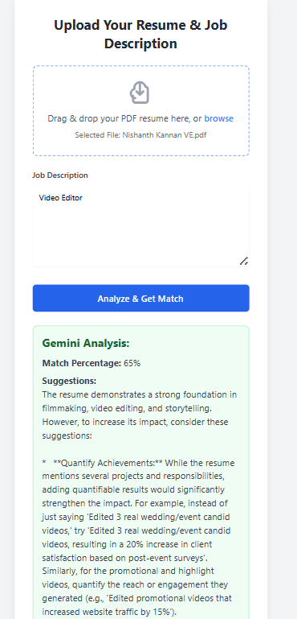

# Resume Parser Application with Gemini AI

This is an Angular application that leverages the Google Gemini API to analyze resumes against job descriptions, providing a match percentage and actionable suggestions for improvement.

## Features

*   **PDF Resume Upload:** Easily upload your resume in PDF format.
*   **Job Description Input:** Provide a job description for analysis.
*   **Gemini AI Integration:** Utilizes the `gemini-2.0-flash` model for intelligent resume-to-job description matching and feedback.
*   **Match Percentage:** Get a numerical score indicating how well your resume aligns with the job requirements.
*   **Detailed Suggestions:** Receive comprehensive suggestions for improving your resume to better fit the target role.

## Getting Started

Follow these instructions to get a copy of the project up and running on your local machine for development and testing purposes.

### Prerequisites

Before you begin, ensure you have the following installed:

*   Node.js (v18 or later)
*   npm (Node Package Manager)
*   Angular CLI: `npm install -g @angular/cli`
*   A Google Gemini API Key: Obtain one for free from [Google AI Studio](https://aistudio.google.com/app/apikey).
    *   Ensure the **Generative Language API** is enabled for your Google Cloud project (check via [Google Cloud Console API Library](https://console.cloud.google.com/apis/library)).

### Installation

1.  **Clone the repository:**
    ```bash
    git clone https://github.com/your-username/resume-parser-app.git
    cd resume-parser-app
    ```

2.  **Install dependencies:**
    ```bash
    npm install
    ```

3.  **Configure your Gemini API Key:**
    *   Open `src/environments/environment.ts`.
    *   Replace `'YOUR_API_KEY_HERE'` with your actual Gemini API key.
    ```typescript
    export const environment = {
      production: false,
      geminiApiKey: 'YOUR_ACTUAL_GEMINI_API_KEY' // <--- PASTE YOUR KEY HERE
    };
    ```
    *   **Important:** `src/environments/environment.ts` is already in `.gitignore`, so your API key will not be pushed to GitHub.

### Running the Application

To start the development server:

```bash
ng serve
```

Open your browser and navigate to `http://localhost:4200/` (or the port specified by `ng serve` if 4200 is in use).

## Usage

1.  On the application page, drag and drop your PDF resume into the designated area or use the browse option.
2.  Enter the job description in the provided text area.
3.  Click the "Analyze & Get Match" button.
4.  The application will display the "Gemini Analysis" with a match percentage and detailed suggestions.

### Example Output



## Contributing

Feel free to fork this repository, make improvements, and submit pull requests.

## License

This project is open-source and available under the [MIT License](LICENSE).
